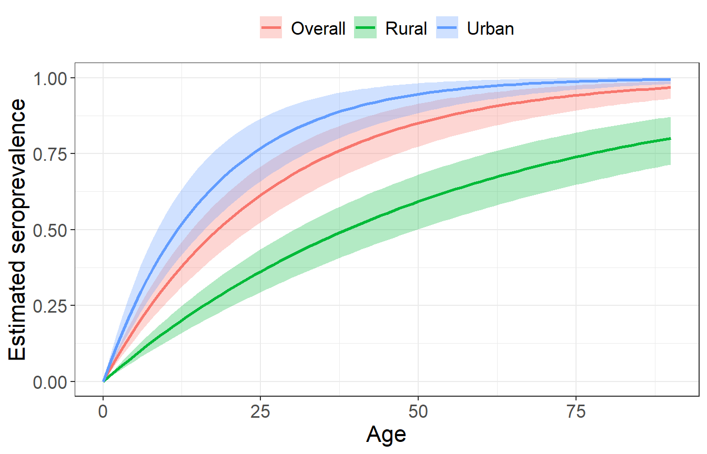
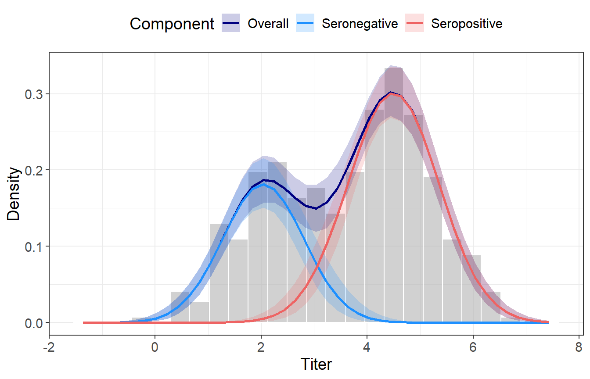
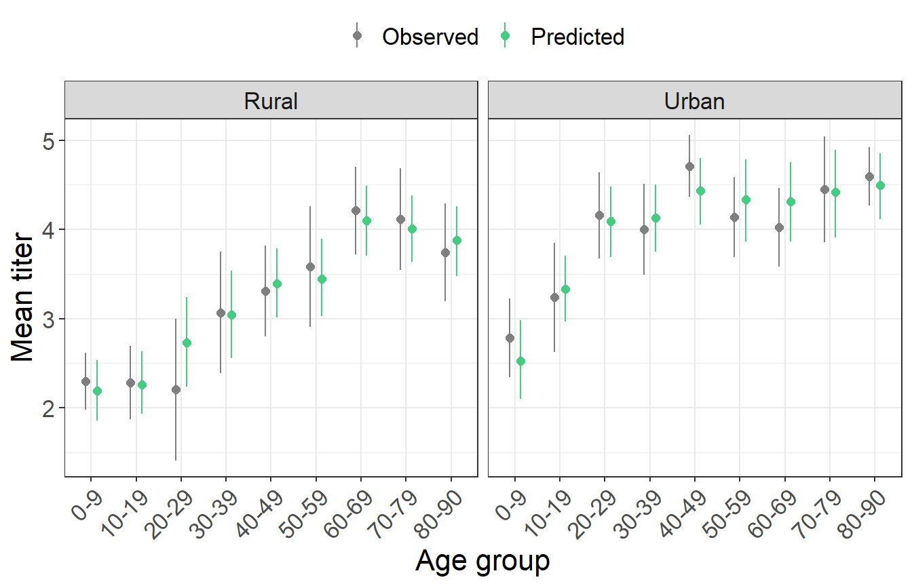

# MixCat

MixCat fits **mixture** and **mixture-catalytic** models to antibody
titer data using Stan. Both models represent the population titer
distribution as a two-component Gaussian mixture, where the two
components correspond to seronegative (μ₀, σ₀) and seropositive (μ₀ +
μ₁, σ₁) individuals. Age-specific seroprevalence is estimated either
directly from the mixture components (`Mixture`) or jointly with a force
of infection (FOI) parameter via a catalytic model (`MixtureCatalytic`).
See the introductory
[vignette](https://github.com/meganodris/MixCat/blob/main/vignettes/Vignette.md)
for a full worked example including the **`Mixture`** and
**`Mixture Catalytic`** models, convergence diagnostics, and all
available extract and plot functions.

## Models

| Stan model | Overview |
|:---|:---|
| `Mixture` | Age-specific seroprevalence estimated directly from the mixture (no endemicity assumption) |
| `MixtureCatalytic` | Age-specific seroprevalence and FOI jointly inferred from a mixture-catalytic model (assumes endemic transmission) |

Both models support stratified estimates by sub-population
(e.g. urban/rural, sex) via an optional `group` argument.

## When to use each model

These models should only be used when the population antibody titer
distribution shows a bimodal pattern (i.e. some separation between
seropositive and seronegative individuals), or when the approximate
titer range for each group is known from control samples and can be used
to inform priors.

**`Mixture`** makes no assumption about transmission dynamics and can be
used in all scenarios. Age-specific seroprevalence estimates from this
model can give an agnostic indication of past transmission dynamics
(e.g. endemic or epidemic) for pathogens that induce life-long
serological responses.

**`MixtureCatalytic`** can be used when endemic transmission is a
reasonable assumption, for example when a trend of increasing
seroprevalence by age was observed from the **`Mixture`** model.

#### Assumptions

- Both models assume the population is composed of seronegative and
  seropositive individuals. Estimates may be unreliable when true
  seroprevalence is close to 0% or 100%.
- Both models assume no antibody waning or seroreversion. Seroprevalence
  will be underestimated for pathogens where antibodies wane over short
  timescales.
- **`MixtureCatalytic`** assumes a constant endemic FOI with no
  differences in infection risk by age or over time. For pathogens with
  seasonal or annual fluctuations, the FOI estimate will represent a
  long-term average.

## Setup

Clone the repository and source the helper functions:

``` r
# install.packages(c("rstan", "bayesplot", "tidyverse"))
library(rstan)
library(bayesplot)
library(tidyverse)

source("utils.R")
rstan_options(auto_write = TRUE)
options(mc.cores = parallel::detectCores())
```

## Data preparation

MixCat requires only two inputs:

- **`titer`**: numeric vector of antibody titer values (log-transform
  first for measurements on a large scale)
- **`age_group`**: integer vector assigning each individual to an age
  group (youngest group = 1)
- **`group`** *(optional)*: integer vector identifying sub-population
  groups for stratified estimates

`make_model_data()` assembles the Stan input list. The `prior_means` and
`prior_sds` arguments specify Normal priors for μ₀, μ₁, σ₀, σ₁ — choose
values consistent with the scale of your titer data. Note that μ₁ is the
*increment* from seronegative to seropositive, not the absolute
seropositive mean.

``` r
df <- load_example_data()
head(df)
```

    ##   age_group location     titer age_group_int location_int
    ## 1     80-90    Rural 1.6964506             9            1
    ## 2     80-90    Rural 3.0761887             9            1
    ## 3     20-29    Rural 0.4808274             3            1
    ## 4     70-79    Urban 4.1101071             8            2
    ## 5     50-59    Rural 6.5925526             6            1
    ## 6     40-49    Rural 4.9717100             5            1

``` r
ageL <- c(0, 10, 20, 30, 40, 50, 60, 70, 80)
ageU <- c(9, 19, 29, 39, 49, 59, 69, 79, 90)

model_data <- make_model_data(
  titer       = df$titer,
  age_group   = df$age_group_int,
  ageL        = ageL,
  ageU        = ageU,
  group       = df$location_int,
  prior_means = c(2, 3, 1, 1),
  prior_sds   = c(1, 1, 1, 1)
)
```

## Model fitting

``` r
# fit mixture catalytic model
fit <- stan(
  file    = "StanModels/MixtureCatalytic.stan",
  data    = model_data,
  chains  = 3, cores  = 1,
  iter    = 1500, warmup = 500
)

# extract model draws
draws <- rstan::extract(fit)
```

## Results

FOI and seroprevalence estimates can be extracted with the `extract_foi`
and `extract_sero` functions. Mixture parameter estimates (μ₀, μ₁, σ₀,
σ₁ and the seropositive mean μ₀ + μ₁) can be extracted with
`extract_mixture_params`:

``` r
extract_foi(draws, model_data, group_labels = c("Rural", "Urban"))
```

    ##     group     median       criL       criU
    ## 1 Overall 0.03786508 0.02941767 0.04984874
    ## 2   Rural 0.01796712 0.01388599 0.02255612
    ## 3   Urban 0.05802479 0.04243349 0.08062711

``` r
extract_sero(draws, model_data, group_labels = c("Rural", "Urban"))
```

    ##     label    median      criL      criU
    ## 1 Overall 0.6499202 0.5947655 0.6978655
    ## 2   Rural 0.5011428 0.4273378 0.5672582
    ## 3   Urban 0.8025892 0.7336876 0.8589687

``` r
extract_mixture_params(draws)
```

    ##     param                        description    median      criL      criU
    ## 1     mu0                  Seronegative mean 2.0398077 1.8828695 2.2134983
    ## 2     mu1 Seropositive increment (above mu0) 2.4548960 2.2654178 2.6294119
    ## 3     sd0                    Seronegative SD 0.7690218 0.6641915 0.9001904
    ## 4     sd1                    Seropositive SD 0.8561214 0.7574016 0.9657785
    ## 5 mu0+mu1                  Seropositive mean 4.4979454 4.3578205 4.6232094

The functions `extract_sero_age_mix` and `extract_sero_age_cat` return
age-specific seroprevalence estimates for the **`Mixture`** and
**`MixtureCatalytic`** models respectively. These estimates can also be
visualised using the corresponding plotting functions,
e.g. `plot_sero_age_cat`.

``` r
extract_sero_age_cat(draws, model_data, group_labels = c("Rural", "Urban")) |> head()
```

    ##   age   seroprev       criL       criU   group
    ## 1   0 0.00000000 0.00000000 0.00000000 Overall
    ## 2   1 0.03715716 0.02898918 0.04862668 Overall
    ## 3   2 0.07293367 0.05713798 0.09488881 Overall
    ## 4   3 0.10738082 0.08447078 0.13890136 Overall
    ## 5   4 0.14054802 0.11101122 0.18077373 Overall
    ## 6   5 0.17248281 0.13678228 0.22060998 Overall

``` r
plot_sero_age_cat(draws, model_data, group_labels = c("Rural", "Urban"))
```

<!-- -->

Model fit to the observed titer distributions can be visualised using
the `plot_dist_fit` and `plot_mean_titer` functions.

``` r
plot_dist_fit(draws, model_data)
```

<!-- -->

``` r
plot_mean_titer(draws, model_data, group_labels = c("Rural", "Urban"))
```

<!-- -->

See the introductory
[vignette](https://github.com/meganodris/MixCat/blob/main/vignettes/Vignette.md)
for a full worked example including the **`Mixture`** and
**`Mixture Catalytic`** models, convergence diagnostics, and all
available extract and plot functions.
