Introduction to MixCat
================

## Overview

MixCat fits **mixture** and **mixture-catalytic** models to antibody
titer data. Both models represent the population titer distribution as a
two-component Gaussian mixture, where the two components represent
seronegative ($\mu_0$, $\sigma_0$) and seropositive ($\mu_0 + \mu_1$,
$\sigma_1$) individuals. Age-specific seroprevalence is estimated either
directly from antibody titer data using a mixture model (`Mixture.stan`)
or jointly with a force of infection (FOI) parameter via a
mixture-catalytic model (`MixtureCatalytic.stan`). Both models support
stratified estimates by sub-populations (e.g. urban/rural) via an
optional `group` argument.

#### When to use each model

In general, these models should only be used when the population
antibody titer distribution has a bimodal pattern (i.e. some separation
of antibody responses between positive and negative individuals) OR if
the approximate range of antibody responses for positive or negative
individuals is known from control samples, which can be used to inform
model priors.

**`Mixture`** makes no assumption about pathogen transmission dynamics
and can therefore be used in all scenarios. Age-specific seroprevalence
estimates from this model can give an agnostic indication of past
transmission dynamics (e.g. endemic or epidemic) for pathogens that
induce life-long serological responses.

**`MixtureCatalytic`** can be used when endemic transmission is a
reasonable assumption, for example when a trend of increasing
seroprevalence by age was observed from the **`Mixture`** model.

Both models support the estimation of age-specific seroprevalence / FOI
by sub-populations (e.g. urban/rural locations, sex, socioeconomic
status).

#### Assumptions

- Both models assume the population to be composed of seronegative and
  seropositive individuals. Model estimates may be unreliable if true
  seroprevalence is close to 0% or 100%.

- Both models assume no antibody waning or seroreversion. Seroprevalence
  will be underestimated for pathogens/antigens where antibodies wane
  over short timescales.

- **`MixtureCatalytic`** assumes a constant endemic force of infection
  (FOI), i.e. no differences in the risk of infection by age or over
  time. For pathogens with seasonal or annual fluctuations in
  transmission intensity, the FOI parameter will represent a long-term
  average annual estimate of this transmission intensity.

------------------------------------------------------------------------

## Setup

Clone the repository and source the helper functions:

``` r
library(rstan)
library(bayesplot)
library(tidyverse)

source("../utils.R")

rstan_options(auto_write = TRUE)            # cache compiled Stan models to disk
options(mc.cores = parallel::detectCores()) # run chains in parallel
```

------------------------------------------------------------------------

## Data Preparation

MixCat inputs:

- **`titer`**: a numeric vector of antibody titer values
- **`age_group`**: an ordered factor assigning each individual to an age
  group
- **`group`** *(optional)*: a factor identifying sub-population groups
  (e.g. location) for stratified estimates

Here we use a simulated dataset of 400 individuals with age group and
location (urban vs rural) information. To prepare the data for model
fitting, an ordered integer age group variable is required such that the
youngest age group = 1 and the oldest age group = total number of age
groups. It is important to check that you have sufficient sample size in
each age group before model fitting. Wider age bins can be used when
sample sizes are low.

``` r
df <- load_example_data("../data/SimulatedData.RDS")
head(df)
```

    ##   age_group location     titer age_group_int location_int
    ## 1     80-90    Rural 1.6964506             9            1
    ## 2     80-90    Rural 3.0761887             9            1
    ## 3     20-29    Rural 0.4808274             3            1
    ## 4     70-79    Urban 4.1101071             8            2
    ## 5     50-59    Rural 6.5925526             6            1
    ## 6     40-49    Rural 4.9717100             5            1

``` r
# Check sample sizes within age groups
table(df$age_group)
```

    ## 
    ##   0-9 10-19 20-29 30-39 40-49 50-59 60-69 70-79 80-90 
    ##    45    52    39    42    50    39    43    40    50

``` r
# Specify age group bounds — must match the levels of the age_group factor in the data
ageL <- c(0, 10, 20, 30, 40, 50, 60, 70, 80)
ageU <- c(9, 19, 29, 39, 49, 59, 69, 79, 90)
```

Before fitting, it is worth visualising the antibody titer distribution
to check whether the data are appropriate for a Gaussian mixture model.
The data are assumed to be composed of two Gaussian distributions — for
antibody measurements on large scales, titer measurements should be
log-transformed before model fitting. This simulated data was generated
on a log titer scale and we can see a rough bimodal pattern, plotted
below.

``` r
ggplot(df, aes(x = titer)) + theme_bw() +
  geom_histogram(bins = 40, fill = "grey", col = "white", position = "identity") +
  xlab("log titer") + ylab("Count") + theme(text = element_text(size = 13))
```

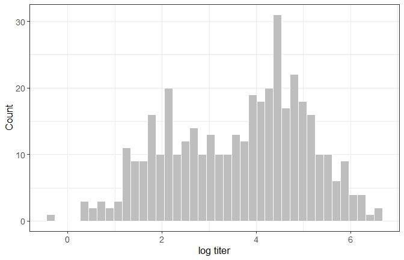<!-- -->

------------------------------------------------------------------------

## Model inputs

`make_model_data()` assembles the Stan model input list. The
`prior_means` and `prior_sds` arguments specify Normal priors for the
four mixture parameters ($\mu_0$, $\mu_1$, $\sigma_0$, $\sigma_1$) in
that order. Choose priors that are consistent with the scale of your
titer data — the values used below reflect log-scale titers centered
near 2–5. Note that $\mu_1$ is the mean rise in antibody titers from
seronegative to seropositive, such that the mean of the seropositive
distribution is defined as $\mu_0 + \mu_1$.

Here we will create two versions of the model input lists, one for
estimating overall population parameters and another for stratified
estimation by location (using the `group` argument).

``` r
# model inputs for overall population model
model_data <- make_model_data(
  titer       = df$titer, # antibody titer measurements
  age_group   = df$age_group_int, # ordered age group integer variable
  ageL        = ageL, # lower age group bounds
  ageU        = ageU, # upper age group bounds
  prior_means = c(2, 3, 1, 1), # prior means (Normal distribution)
  prior_sds   = c(1, 1, 1, 1) # prior SDs (Normal distribution)
)

# model inputs for estimation stratified by location
model_data_loc <- make_model_data(
  titer       = df$titer, # antibody titer measurements
  age_group   = df$age_group_int, # ordered age group integer variable
  ageL        = ageL, # lower age group bounds
  ageU        = ageU, # upper age group bounds
  group       = df$location_int, # location integer variable
  prior_means = c(2, 3, 1, 1), # prior means (Normal distribution)
  prior_sds   = c(1, 1, 1, 1) # prior SDs (Normal distribution)
)
```

------------------------------------------------------------------------

## Mixture model

We will first fit a mixture model, where age-specific seroprevalence is
directly inferred from the antibody titer distributions with no
assumptions about transmission dynamics.

### Fitting

Models are fitted with `rstan::stan()`. The settings below (500 warmup,
1,000 sampling iterations across 3 chains = 3000 posterior draws) are
sufficient for most datasets. Increase `iter` if R-hat values are
elevated or trace plots show poor mixing.

``` r
fit_mix <- stan(
  file    = "../StanModels/Mixture.stan",
  data    = model_data,
  chains  = 3, cores  = 1,
  iter    = 1500, warmup = 500,
  refresh = 100
)
```

### Checking convergence

Trace plots and R-hat values should be checked to assess model
convergence. R-hat values should be $\leq 1.01$ — values above 1.05
indicate poor convergence and model estimates should not be interpreted.

``` r
color_scheme_set("mix-blue-red")
mcmc_trace(fit_mix, regex_pars = c("sero", "mu", "sd"))
```

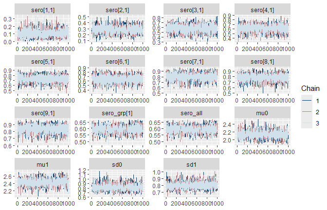<!-- -->

``` r
rhats <- rhat(fit_mix)
mcmc_rhat(rhats[grepl("^(sero|mu|sd)", names(rhats))]) + yaxis_text() + theme_bw()
```

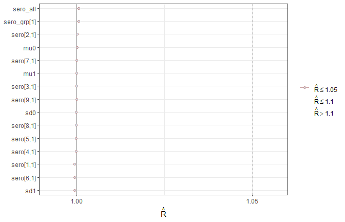<!-- -->

### Model estimates

Overall population seroprevalence estimates can be extracted with the
`extract_sero` function. Here the model estimates 60% (95% credible
interval: 54-65%) population seroprevalence. The function
`extract_sero_age_mix` will return a dataframe of age-specific
seroprevalence estimates from the `Mixture` model and the
`plot_sero_age_mix` function will create a simple plot of these
estimates. If model estimates were stratified by other groups,
e.g. location, the `group_labels` argument can be used to specify
labels.

``` r
draws_mix <- rstan::extract(fit_mix)
extract_sero(draws = draws_mix, model_data = model_data, group_labels = NULL)
```

    ##     label    median      criL      criU
    ## 1 Overall 0.5974571 0.5373107 0.6497456

``` r
# get age-specific seroprevalence estimates from Mixture model
extract_sero_age_mix(draws = draws_mix, model_data = model_data, group_labels = NULL)
```

    ##   age_label age_mid   seroprev       criL      criU
    ## 1       0-9     4.5 0.09837735 0.02440025 0.2191750
    ## 2     10-19    14.5 0.28245004 0.16561672 0.4142556
    ## 3     20-29    24.5 0.58489337 0.40954200 0.7334125
    ## 4     30-39    34.5 0.62433634 0.44179399 0.7696999
    ## 5     40-49    44.5 0.73651499 0.58712299 0.8590507
    ## 6     50-59    54.5 0.65748180 0.48119943 0.8143407
    ## 7     60-69    64.5 0.80911647 0.65373420 0.9267179
    ## 8     70-79    74.5 0.79501212 0.64477066 0.9084929
    ## 9     80-90    85.0 0.84684707 0.70749827 0.9327780

``` r
# plot age-specific seroprevalence estimates from Mixture model
plot_sero_age_mix(draws = draws_mix, model_data = model_data, group_labels = NULL)
```

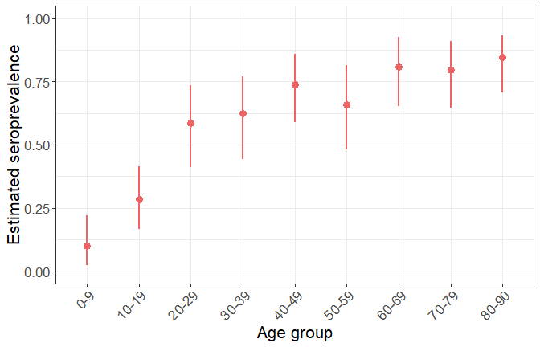<!-- -->

### Assess model fit

The `plot_dist_fit` function can be used to visualize the model fit to
the observed data. Grey bars show the observed antibody titer data while
coloured lines (median estimates) and ribbons (95% credible interval
estimates) show the model reconstructed antibody titer distributions.
For custom plotting, the `extract_dist_fit` function can be used to
obtain the data and estimates underlying this plot. Another way of
assessing model fit is comparing observed and estimated mean titers by
age group - this can be done using the `extract_mean_titer` and
`plot_mean_titer` functions.

``` r
# plot observed vs model reconstructed titer distributions
plot_dist_fit(draws_mix, model_data)
```

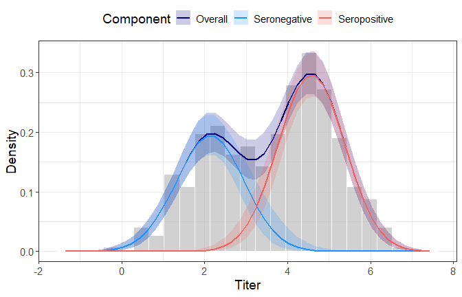<!-- -->

``` r
# plot observed vs model estimated mean titers by age groups
plot_mean_titer(draws = draws_mix, model_data = model_data, group_labels = NULL)
```

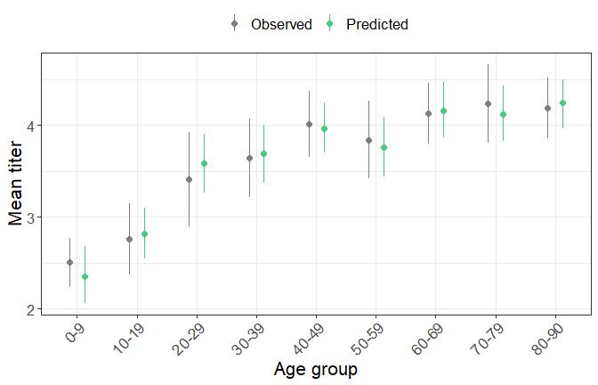<!-- -->

### Probability of seropositivity

The posterior probability of being seropositive given observed titers
can be extracted and plotted using the `extract_prob_seropos` and
`plot_prob_seropos` functions. This can be a useful metric for
understanding where uncertainty is highest in individual serostatus
classification.

``` r
plot_prob_seropos(draws_mix, model_data, group_labels = NULL)
```

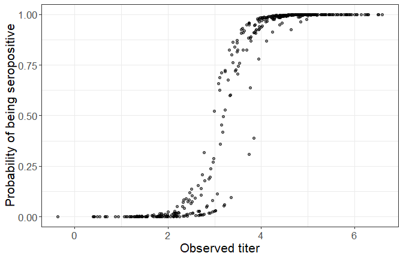<!-- -->

------------------------------------------------------------------------

## MixtureCatalytic model

The **`MixtureCatalytic`** model jointly estimates a force of infection
parameter ($\lambda$) and age-specific seroprevalence from the mixture
components. Age-specific seroprevalence, $\pi(a)$, is derived from the
FOI by $\pi(a) = 1 - e^{-\lambda a}$. This model assumes endemic
transmission, enforcing a trend of increasing seroprevalence by age.

### Fitting

Models are fitted with `rstan::stan()`. The settings below (500 warmup,
1000 sampling iterations across 3 chains = 3000 posterior draws) are
sufficient for most datasets. Increase `iter` if R-hat values are
elevated or trace plots show poor mixing.

Here, we will fit the **`MixtureCatalytic`** model allowing for
stratified estimates by location (using the `model_data_loc` object
created before).

``` r
fit_cat <- stan(
  file    = "../StanModels/MixtureCatalytic.stan",
  data    = model_data_loc,
  chains  = 3, cores  = 1,
  iter    = 1500, warmup = 500,
  refresh = 100
)
```

### Checking convergence

As before, we will look at trace plots and R-hat values to check model
convergence. R-hat values should be $\leq 1.01$ — values above 1.05
indicate poor convergence and model estimates should not be interpreted.

``` r
color_scheme_set("mix-blue-red")
mcmc_trace(fit_cat, regex_pars = c("lambda", "mu", "sd"))
```

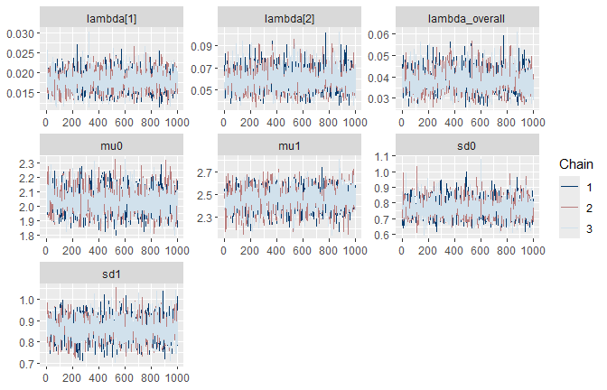<!-- -->

``` r
rhats_cat <- rhat(fit_cat)
mcmc_rhat(rhats_cat[grepl("^(lambda|mu|sd)", names(rhats_cat))]) + yaxis_text() + theme_bw()
```

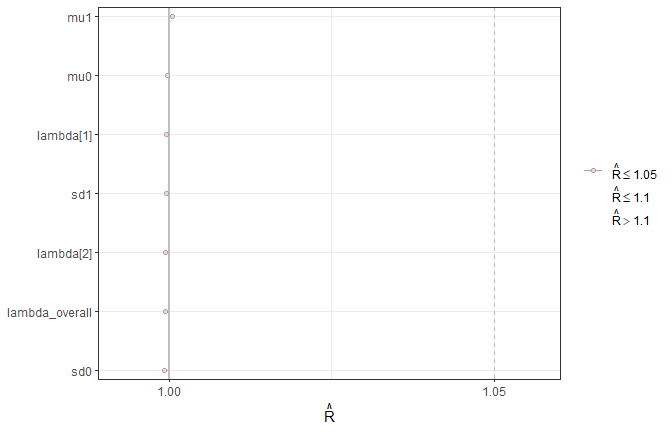<!-- -->

### Model estimates

Population seroprevalence and FOI estimates can be extracted with the
`extract_sero` and `extract_foi()` functions. Here we estimate a lower
FOI in rural locations, 0.02 (95%CrI: 0.01-0.02), compared to 0.06
(95%CrI: 0.04-0.08) in urban locations. This can be interpreted as 2%
(95%CrI: 1-2%) and 6% (95%CrI: 4-8%) of the susceptible population
become infected each year in rural and urban locations respectively.

``` r
draws_cat <- rstan::extract(fit_cat)

# extract FOI estimates by location
extract_foi(draws_cat, model_data_loc, group_labels = c("Rural", "Urban"))
```

    ##     group     median       criL       criU
    ## 1 Overall 0.03774554 0.02943425 0.04903226
    ## 2   Rural 0.01788686 0.01366939 0.02269158
    ## 3   Urban 0.05782585 0.04305592 0.08037574

``` r
# extract population seroprevalence estimates by location
extract_sero(draws_cat, model_data_loc, group_labels = c("Rural", "Urban"))
```

    ##     label    median      criL      criU
    ## 1 Overall 0.6492860 0.5933546 0.6983310
    ## 2   Rural 0.4998408 0.4229466 0.5689846
    ## 3   Urban 0.8019140 0.7372147 0.8585081

``` r
# extract age-specific seroprevalence estimates by location
extract_sero_age_cat(draws_cat, model_data_loc, group_labels = c("Rural", "Urban")) |> head()
```

    ##   age   seroprev       criL       criU   group
    ## 1   0 0.00000000 0.00000000 0.00000000 Overall
    ## 2   1 0.03704206 0.02900528 0.04784958 Overall
    ## 3   2 0.07271200 0.05716926 0.09340958 Overall
    ## 4   3 0.10706065 0.08451633 0.13678956 Overall
    ## 5   4 0.14013696 0.11107020 0.17809382 Overall
    ## 6   5 0.17198805 0.13685386 0.21742169 Overall

``` r
# plot age-specific seroprevalence estimates
plot_sero_age_cat(draws_cat, model_data_loc, group_labels = c("Rural", "Urban"))
```

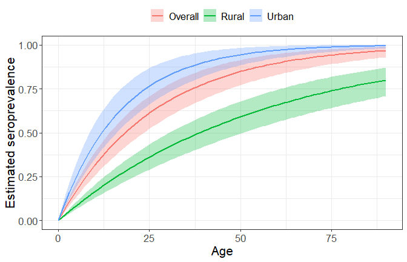<!-- -->

### Assess model fit

The `plot_dist_fit` function can be used to visualize the model fit to
the observed data. Grey bars show the observed antibody titer data while
coloured lines (median estimates) and ribbons (95% credible interval
estimates) show the model reconstructed antibody titer distributions.
For custom plotting, the `extract_dist_fit` function can be used to
obtain the data and estimates underlying this plot. Another way of
assessing model fit is comparing observed and estimated mean titers by
age group - this can be done using the `extract_mean_titer` and
`plot_mean_titer` functions.

``` r
# plot observed vs model reconstructed titer distributions
plot_dist_fit(draws_cat, model_data_loc)
```

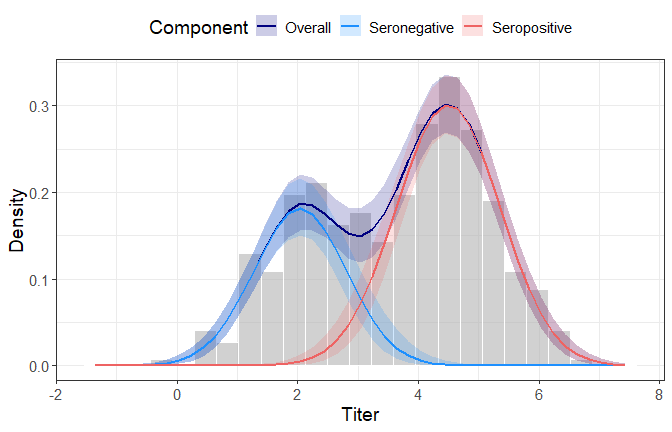<!-- -->

``` r
# plot observed vs model estimated mean titers by age groups
plot_mean_titer(draws = draws_cat, model_data = model_data_loc, group_labels = c("Rural", "Urban"))
```

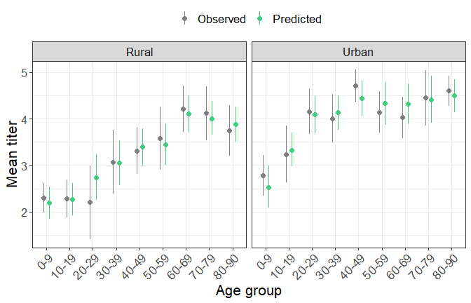<!-- -->

### Probability of seropositivity

The posterior probability of being seropositive given observed titers
can be extracted and plotted using the `extract_prob_seropos` and
`plot_prob_seropos` functions. This can be a useful metric for
understanding where uncertainty is highest in individual serostatus
classification.

``` r
plot_prob_seropos(draws_cat, model_data_loc, group_labels = c("Rural", "Urban"))
```

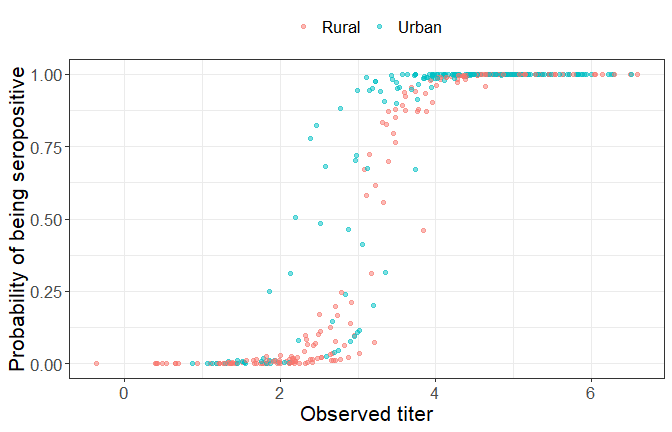<!-- -->
